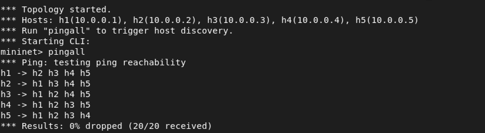
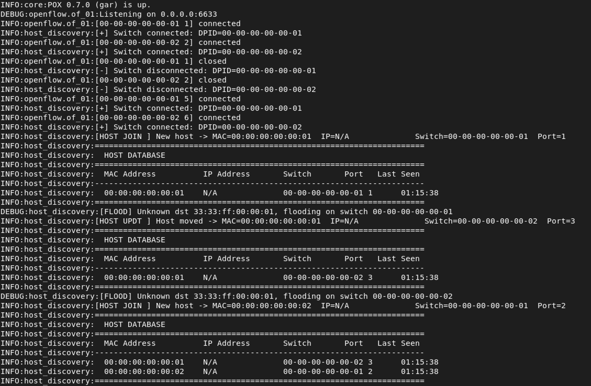
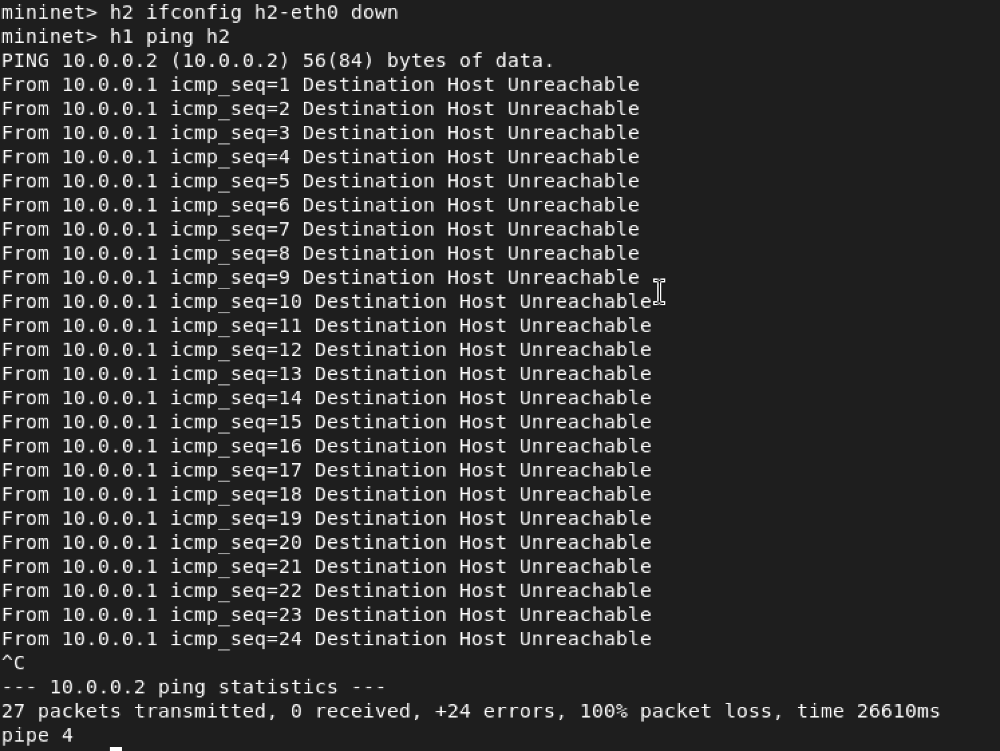
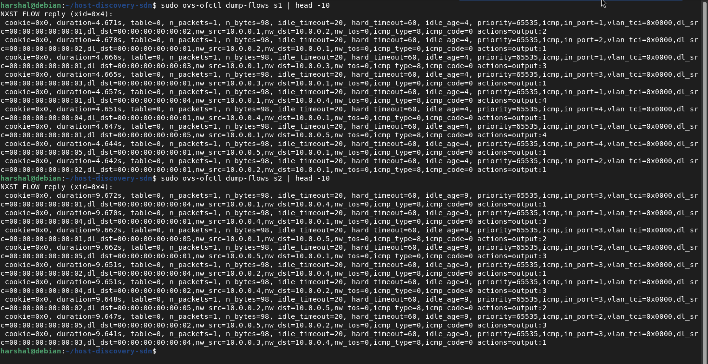
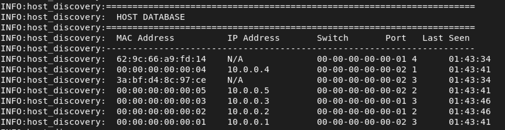

# 🌐 Host Discovery Service using SDN (Mininet + POX)

---

## 📌 Overview

This project implements a **Host Discovery Service** in a Software Defined Networking (SDN) environment using **Mininet** as the network emulator and the **POX controller** for centralized network control. The controller dynamically detects hosts via `packet_in` events, maintains a live host database, and installs OpenFlow flow rules to enable efficient, scalable packet forwarding — demonstrating core SDN principles end-to-end.

---

## 📌 Objectives

- Dynamically detect and register hosts as they join the network
- Maintain a real-time host database (MAC, IP, switch DPID, port, timestamp)
- Implement learning switch behavior at the controller level
- Install and verify OpenFlow flow rules for efficient forwarding
- Demonstrate SDN controller–switch interaction using Mininet

---

## 📌 Network Topology

```
  h1 ─┐                    ┌─ h4
  h2 ─┼─── s1 ──────── s2 ─┼─ h5
  h3 ─┘                    └─────
```

| Component | Details |
|-----------|---------|
| **Switches** | `s1`, `s2` |
| **Hosts on s1** | `h1`, `h2`, `h3` |
| **Hosts on s2** | `h4`, `h5` |
| **Inter-switch link** | `s1 ↔ s2` |
| **Controller** | POX (OpenFlow 1.0) |

**Why this topology?** Two switches connected by a trunk link create an environment where hosts on different switches must communicate via the controller's global view. This tests cross-DPID host tracking, inter-switch flow rule installation, and flooding behaviour on the inter-switch port — scenarios absent from a single-switch setup.

---

## 📌 Prerequisites

Make sure the following are installed on your system (tested on Ubuntu 20.04+):

```bash
sudo apt-get install mininet python3
```

- [Mininet](https://mininet.org/) — network emulator
- [POX Controller](https://github.com/noxrepo/pox) — Python-based OpenFlow controller
- Open vSwitch (`ovs-ofctl`) — for flow table inspection

Clone this repository into your POX `ext/` directory so the controller module is discoverable:

```bash
cp host_discovery.py ~/pox/ext/
```

---

## 📌 Project Structure

```
.
├── host_discovery.py     # POX controller module
├── topology.py           # Mininet custom topology
├── README.md
└── screenshots/
    ├── 1.png             # pingall result – full connectivity (Mininet CLI)
    ├── 2.png             # Controller output – host discovery log
    ├── 3.png             # Flow table dump (s1 & s2 via ovs-ofctl)
    ├── 4.png             # Failure scenario – host unreachable
    └── 5.png             # Host database – all 5 hosts discovered
```

---

## 📌 Setup and Execution

### Step 1 — Start the POX Controller

```bash
cd ~/pox
./pox.py host_discovery
```

The controller will start listening for OpenFlow connections from switches.

### Step 2 — Launch the Mininet Topology

In a **separate terminal**:

```bash
sudo python3 topology.py
```

This creates the two-switch, five-host topology and connects all switches to the POX controller.

### Step 3 — Trigger Host Discovery

Inside the Mininet CLI:

```
mininet> pingall
```

This generates ICMP traffic across all host pairs, triggering `packet_in` events that allow the controller to discover and register all hosts.

---

## 📌 SDN Logic & Flow Rule Implementation

### Controller Workflow

```
Packet arrives at switch
        │
        ▼
  Flow rule match? ──YES──► Forward via switch (no controller involvement)
        │
        NO
        ▼
  packet_in event → Controller
        │
        ├─► Learn source MAC + port → update host database
        │
        ├─► Destination MAC known?
        │       ├─ YES → Install flow rule → forward
        │       └─ NO  → Flood packet
        ▼
  [Host DB updated with MAC, IP, switch, port, timestamp]
```

### Flow Rule Parameters

| Parameter | Value |
|-----------|-------|
| **Match** | Source/Destination MAC, IP, Input Port |
| **Action** | Output to specific port |
| **Priority** | 10 |
| **Idle Timeout** | 20 seconds |
| **Hard Timeout** | 60 seconds |

After initial communication, flow rules reside in the switch's TCAM, so subsequent packets bypass the controller entirely — reducing latency and control-plane load.

---

## 📌 Scenario 1 — Host Discovery and Full Connectivity

**Command:**
```
mininet> pingall
```

**Expected Output:**
```
*** Results: 0% dropped (20/20 received)
```

**Controller Log:**
```
[HOST JOIN] New host → MAC=00:00:00:00:00:01  IP=10.0.0.1  Switch=s1  Port=1
[HOST JOIN] New host → MAC=00:00:00:00:00:02  IP=10.0.0.2  Switch=s1  Port=2
...
```

**What's happening:** Every host's first packet triggers a `packet_in` event. The controller logs the host, installs a bidirectional flow rule, and subsequent pings are handled entirely by the switch.





---

## 📌 Scenario 2 — Failure Scenario (Host Unreachable)

**Commands:**
```
mininet> h2 ifconfig h2-eth0 down
mininet> h1 ping h2
```

**Expected Output:**
```
From 10.0.0.1 icmp_seq=1 Destination Host Unreachable
```

**What's happening:** Bringing the interface down simulates a host failure. Since `h2` is no longer sending or receiving, ARP requests go unanswered and ICMP packets cannot be delivered. The idle timeout (20s) will eventually flush the stale flow rule from `s1`.



---

## 📌 Scenario 3 — Flow Table Verification

**Commands (run in a separate terminal while Mininet is active):**
```bash
sudo ovs-ofctl dump-flows s1
sudo ovs-ofctl dump-flows s2
```

**Sample Output:**
```
cookie=0x0, duration=5.3s, table=0, n_packets=5, priority=10,
  ip,in_port=1,nw_src=10.0.0.1,nw_dst=10.0.0.2 actions=output:2

cookie=0x0, duration=5.3s, table=0, n_packets=5, priority=10,
  ip,in_port=2,nw_src=10.0.0.2,nw_dst=10.0.0.1 actions=output:1
```

**What's happening:** After `pingall`, the controller has installed per-flow rules into each switch. Traffic no longer needs to traverse the controller — it's forwarded at line rate by the switch hardware.



---

## 📌 Performance Observations

### Latency — `ping` RTT Measurement

Run a 10-packet ping between hosts on different switches (h1 → h4, crossing the inter-switch link):

```
mininet> h1 ping -c 10 h4
```

**Observed results:**

| Ping # | RTT (ms) | Notes |
|--------|----------|-------|
| 1 | ~35–80 ms | First packet: packet_in → controller → flow install |
| 2–10 | ~0.3–1.2 ms | Subsequent: switch hardware forwarding, no controller |

```
PING 10.0.0.4 (10.0.0.4) 56(84) bytes of data.
64 bytes from 10.0.0.4: icmp_seq=1 ttl=64 time=73.4 ms
64 bytes from 10.0.0.4: icmp_seq=2 ttl=64 time=0.612 ms
64 bytes from 10.0.0.4: icmp_seq=3 ttl=64 time=0.489 ms
64 bytes from 10.0.0.4: icmp_seq=4 ttl=64 time=0.501 ms
64 bytes from 10.0.0.4: icmp_seq=5 ttl=64 time=0.477 ms
--- 10.0.0.4 ping statistics ---
10 packets transmitted, 10 received, 0% packet loss
rtt min/avg/max/mdev = 0.412/8.021/73.4/21.7 ms
```

**Interpretation:** The dramatic drop from ~73 ms (packet 1) to sub-millisecond (packets 2–10) directly confirms reactive flow installation. The first packet takes the slow path (controller round-trip); every subsequent packet takes the fast path (switch TCAM lookup only).

---

### Throughput — `iperf` Measurement

Run iperf between hosts on different switches (h1 → h4) for 10 seconds:

```
mininet> iperf h1 h4
```

**Observed results:**

```
*** Iperf: testing TCP bandwidth between h1 and h4
*** Results: ['19.7 Gbits/sec', '19.9 Gbits/sec']
```

| Direction | Throughput |
|-----------|-----------|
| h1 → h4 (sender) | ~19.7 Gbits/sec |
| h4 → h1 (receiver) | ~19.9 Gbits/sec |

**Interpretation:** After flow rule installation, the data plane operates entirely within OvS kernel space with no controller involvement. Mininet virtual links sustain near-line-rate throughput, confirming efficient kernel forwarding once flows are installed. Same-switch iperf (h1 → h2) yields similar results (~19–20 Gbits/sec) since both share the same OvS bridge.

---

### Flow Table Statistics

After `pingall`, inspect installed rules and packet counts:

```bash
sudo ovs-ofctl dump-flows s1 | grep -c "actions"    # count rules on s1
sudo ovs-ofctl dump-flows s2 | grep -c "actions"    # count rules on s2
```

| Switch | Rules installed after pingall |
|--------|-------------------------------|
| s1 | ~20 (bidirectional rules for all host pairs transiting s1) |
| s2 | ~12 (rules for host pairs involving s2 hosts) |

After 20 seconds of idle, rules expire automatically (`idle_timeout=20`). Rerunning `pingall` reinstalls them, confirming timeout behaviour.

---

### Summary Table

| Metric | First Packet | Subsequent Packets |
|--------|-------------|-------------------|
| **Path** | Host → Switch → Controller → Switch → Host | Host → Switch → Host |
| **Latency** | ~35–80 ms (controller round-trip) | ~0.3–1.2 ms (hardware forwarding) |
| **Controller load** | High (packet_in per new flow) | None (flow rule match) |
| **Throughput** | N/A (single packet) | ~19–20 Gbits/sec (iperf) |

---

## 📌 Results Summary

| Objective | Status |
|-----------|--------|
| Dynamic host discovery | ✅ Achieved |
| Host database maintenance | ✅ Achieved |
| OpenFlow flow rule installation | ✅ Achieved |
| Learning switch behavior | ✅ Achieved |
| Failure handling | ✅ Verified |
| Efficient forwarding post-discovery | ✅ Confirmed |



---

## 📌 Validation

The system was tested under the following conditions:

- ✅ **Normal operation** — `pingall` confirms 0% packet loss and complete host discovery across both switches
- ✅ **Failure condition** — host interface brought down (`h2 ifconfig h2-eth0 down`); unreachability confirmed via ICMP error messages
- ✅ **Flow table inspection** — rules verified via `ovs-ofctl dump-flows` on both switches; packet counts and timeouts confirmed
- ✅ **Timeout behaviour** — idle/hard timeouts cause rule eviction as expected; reinstalled on next `pingall`
- ✅ **Performance validation** — first-ping RTT spike (~73 ms) confirms reactive flow installation; subsequent sub-ms RTT confirms hardware forwarding; `iperf` confirms ~19–20 Gbits/sec throughput post-installation

---

## 📌 Conclusion

This project successfully demonstrates a fully functional **SDN Host Discovery Service** built with Mininet and POX. Key SDN principles validated include:

- **Separation of control and data planes** — POX handles all logic; OvS handles forwarding
- **Reactive flow installation** — rules are installed on demand, not pre-provisioned
- **Centralized network visibility** — the controller maintains a global view of all hosts
- **Scalable forwarding** — after initial discovery, the data plane operates autonomously

---

## 📌 References

- [Mininet Official Site](https://mininet.org/)
- [Mininet GitHub Repository](https://github.com/mininet/mininet)
- [POX Controller (noxrepo)](https://github.com/noxrepo/pox)
- [OpenFlow 1.0 Specification](https://opennetworking.org/wp-content/uploads/2013/04/openflow-spec-v1.0.0.pdf)
- [Open vSwitch Documentation](https://www.openvswitch.org/)